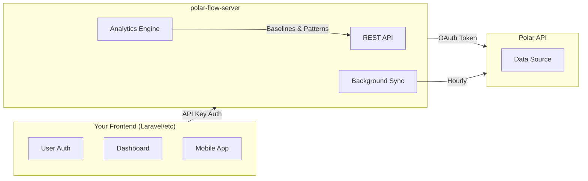

# Integration Guide

How to consume polar-flow-server from your application (Laravel, Next.js, mobile apps, etc.).

## Architecture Overview



**Your app handles:**
- User authentication (login, sessions, JWT)
- User management
- Rendering dashboards/UI
- User-facing notifications

**polar-flow-server handles:**
- Polar API integration & data sync
- Data storage (PostgreSQL)
- Analytics calculations
- Baseline & pattern detection

---

## API Authentication

All data endpoints require an API key via the `X-API-Key` header.

```bash
# Example request with API key
curl -H "X-API-Key: pfk_your_api_key_here" \
  http://your-server:8000/api/v1/users/12345/sleep?days=7
```

### Getting an API Key

API keys are created in the admin dashboard when users connect their Polar account via OAuth. For self-hosted deployments, you can also use the CLI:

```bash
# Create a new API key
uv run polar-flow-server api-key create --name "Laravel Production"

# Output: API Key: pfk_xxxxxxxxxxxxxxxxxxxx (save this - only shown once!)
```

---

## Quick Start: Laravel Integration

### 1. Store Configuration

```php
// config/services.php
return [
    'polar_flow' => [
        'url' => env('POLAR_FLOW_URL', 'http://localhost:8000'),
        'api_key' => env('POLAR_FLOW_API_KEY'),
    ],
];
```

```bash
# .env
POLAR_FLOW_URL=https://polar-flow.example.com
POLAR_FLOW_API_KEY=pfk_your_api_key_here
```

### 2. Create HTTP Client Service

```php
<?php
// app/Services/PolarFlowService.php

namespace App\Services;

use Illuminate\Support\Facades\Http;
use Illuminate\Http\Client\PendingRequest;

class PolarFlowService
{
    protected PendingRequest $client;

    public function __construct()
    {
        $this->client = Http::baseUrl(config('services.polar_flow.url') . '/api/v1')
            ->withHeaders([
                'X-API-Key' => config('services.polar_flow.api_key'),
            ])
            ->timeout(30);
    }

    /**
     * Get sleep data for a user.
     */
    public function getSleep(string $userId, int $days = 7): array
    {
        return $this->client
            ->get("/users/{$userId}/sleep", ['days' => $days])
            ->throw()
            ->json();
    }

    /**
     * Get unified insights for a user.
     * This is the main endpoint for dashboards.
     */
    public function getInsights(string $userId): array
    {
        return $this->client
            ->get("/users/{$userId}/insights")
            ->throw()
            ->json();
    }

    /**
     * Get activity data.
     */
    public function getActivity(string $userId, int $days = 30): array
    {
        return $this->client
            ->get("/users/{$userId}/activity", ['days' => $days])
            ->throw()
            ->json();
    }

    /**
     * Get exercises/workouts.
     */
    public function getExercises(string $userId, int $days = 30): array
    {
        return $this->client
            ->get("/users/{$userId}/exercises", ['days' => $days])
            ->throw()
            ->json();
    }

    /**
     * Get HRV/recharge data.
     */
    public function getRecharge(string $userId, int $days = 30): array
    {
        return $this->client
            ->get("/users/{$userId}/recharge", ['days' => $days])
            ->throw()
            ->json();
    }

    /**
     * Get cardio load data.
     */
    public function getCardioLoad(string $userId, int $days = 30): array
    {
        return $this->client
            ->get("/users/{$userId}/cardio-load", ['days' => $days])
            ->throw()
            ->json();
    }

    /**
     * Get personal baselines.
     */
    public function getBaselines(string $userId): array
    {
        return $this->client
            ->get("/users/{$userId}/baselines")
            ->throw()
            ->json();
    }

    /**
     * Get detected patterns.
     */
    public function getPatterns(string $userId): array
    {
        return $this->client
            ->get("/users/{$userId}/patterns")
            ->throw()
            ->json();
    }

    /**
     * Scan for anomalies.
     */
    public function getAnomalies(string $userId): array
    {
        return $this->client
            ->get("/users/{$userId}/anomalies")
            ->throw()
            ->json();
    }

    /**
     * Trigger a manual sync for a user.
     * Requires the user's Polar access token.
     */
    public function triggerSync(string $userId, string $polarToken, int $days = 30): array
    {
        return $this->client
            ->withHeaders(['X-Polar-Token' => $polarToken])
            ->post("/users/{$userId}/sync/trigger", ['days' => $days])
            ->throw()
            ->json();
    }
}
```

### 3. Register the Service

```php
// app/Providers/AppServiceProvider.php

public function register(): void
{
    $this->app->singleton(PolarFlowService::class);
}
```

### 4. Use in Controllers

```php
<?php
// app/Http/Controllers/DashboardController.php

namespace App\Http\Controllers;

use App\Services\PolarFlowService;
use Illuminate\Http\Request;

class DashboardController extends Controller
{
    public function __construct(
        protected PolarFlowService $polarFlow
    ) {}

    public function index(Request $request)
    {
        $user = $request->user();

        // Fetch unified insights (recommended for dashboards)
        $insights = $this->polarFlow->getInsights($user->polar_user_id);

        return view('dashboard', [
            'insights' => $insights,
            'currentMetrics' => $insights['current_metrics'],
            'baselines' => $insights['baselines'],
            'patterns' => $insights['patterns'],
            'observations' => $insights['observations'],
            'suggestions' => $insights['suggestions'],
        ]);
    }

    public function sleep(Request $request)
    {
        $user = $request->user();
        $days = $request->get('days', 30);

        $sleep = $this->polarFlow->getSleep($user->polar_user_id, $days);

        return view('sleep', ['sleep' => $sleep]);
    }
}
```

---

## Key Endpoints for Dashboards

### 1. `/users/{user_id}/insights` (Recommended)

**Use this endpoint for dashboards.** It aggregates everything into a single response:

- Current metric values
- Personal baseline comparisons
- Detected patterns (correlations, trends, risk scores)
- Anomalies
- Natural language observations
- Actionable suggestions

```php
$insights = $polarFlow->getInsights($userId);

// Check data availability
if ($insights['status'] === 'unavailable') {
    // Show onboarding message
    return "Keep wearing your device! Insights unlock after 7 days.";
}

// Display current metrics
$hrv = $insights['current_metrics']['hrv'];
$sleepScore = $insights['current_metrics']['sleep_score'];

// Display suggestions
foreach ($insights['suggestions'] as $suggestion) {
    echo "{$suggestion['description']} (confidence: {$suggestion['confidence']})";
}
```

### 2. `/users/{user_id}/baselines`

Get personal baselines for anomaly detection:

```php
$baselines = $polarFlow->getBaselines($userId);

foreach ($baselines as $baseline) {
    echo "{$baseline['metric_name']}: {$baseline['baseline_value']}";
    echo "7-day: {$baseline['baseline_7d']}, 30-day: {$baseline['baseline_30d']}";
    echo "Range: {$baseline['min']} - {$baseline['max']}";
}
```

### 3. `/users/{user_id}/patterns`

Get detected patterns:

```php
$patterns = $polarFlow->getPatterns($userId);

foreach ($patterns as $pattern) {
    if ($pattern['pattern_name'] === 'overtraining_risk') {
        $risk = $pattern['score'];
        $severity = $pattern['significance'];

        if ($severity === 'high') {
            // Alert user about overtraining risk
        }
    }
}
```

---

## Feature Availability Timeline

Features unlock progressively as users accumulate data:

| Days | Features Available |
|------|--------------------|
| 0-6 | Raw data only, no analytics |
| 7+ | 7-day baselines |
| 21+ | Pattern detection, anomaly detection |
| 30+ | Full 30-day baselines |
| 60+ | ML predictions (future) |

Check availability in the insights response:

```php
$insights = $polarFlow->getInsights($userId);

if ($insights['feature_availability']['patterns']['available']) {
    // Show patterns section
} else {
    $message = $insights['feature_availability']['patterns']['message'];
    // Show: "Patterns unlock in 14 days"
}
```

---

## User Mapping

Your app needs to track which Polar user ID belongs to which app user.

### Database Schema

```php
// Laravel migration
Schema::table('users', function (Blueprint $table) {
    $table->string('polar_user_id')->nullable()->unique();
    $table->timestamp('polar_connected_at')->nullable();
});
```

### OAuth Flow

When users connect their Polar account:

1. User clicks "Connect Polar" in your app
2. Redirect to polar-flow-server's OAuth endpoint
3. polar-flow-server handles Polar OAuth
4. Callback returns with `polar_user_id`
5. Store the mapping in your `users` table

---

## Error Handling

```php
use Illuminate\Http\Client\RequestException;

try {
    $insights = $polarFlow->getInsights($userId);
} catch (RequestException $e) {
    $status = $e->response->status();

    if ($status === 401) {
        // Invalid API key
        Log::error('Polar Flow API key is invalid');
    } elseif ($status === 404) {
        // User not found
        // Prompt user to connect Polar account
    } elseif ($status === 429) {
        // Rate limited
        Log::warning('Polar Flow rate limited');
    } else {
        throw $e;
    }
}
```

---

## Caching Strategy

Polar data doesn't change frequently. Cache responses:

```php
use Illuminate\Support\Facades\Cache;

public function getInsights(string $userId): array
{
    return Cache::remember(
        "polar_insights_{$userId}",
        now()->addMinutes(15),
        fn () => $this->client
            ->get("/users/{$userId}/insights")
            ->throw()
            ->json()
    );
}
```

Invalidate cache when user triggers manual sync:

```php
public function triggerSync(string $userId, string $polarToken): array
{
    $result = $this->client
        ->withHeaders(['X-Polar-Token' => $polarToken])
        ->post("/users/{$userId}/sync/trigger")
        ->throw()
        ->json();

    // Clear cached data
    Cache::forget("polar_insights_{$userId}");
    Cache::forget("polar_sleep_{$userId}");

    return $result;
}
```

---

## Background Sync

polar-flow-server automatically syncs data every hour (configurable). Your app doesn't need to trigger syncs unless you want immediate updates.

### Auto-sync Configuration

On the server side:
```bash
SYNC_ENABLED=true
SYNC_INTERVAL_MINUTES=60
```

### Manual Sync from Your App

Only trigger manual syncs when users explicitly request it:

```php
// In your controller
public function refresh(Request $request)
{
    $user = $request->user();

    // Get user's Polar token from your storage
    $polarToken = decrypt($user->polar_access_token);

    $result = $this->polarFlow->triggerSync(
        $user->polar_user_id,
        $polarToken
    );

    return back()->with('success', 'Data synced! New records: ' . array_sum($result['results']));
}
```

---

## Complete API Reference

See [API Reference](api/overview.md) for all available endpoints.

### Data Endpoints
- `/users/{user_id}/sleep` - Sleep data
- `/users/{user_id}/activity` - Daily activity
- `/users/{user_id}/recharge` - HRV/Nightly Recharge
- `/users/{user_id}/exercises` - Workouts
- `/users/{user_id}/cardio-load` - Training load
- `/users/{user_id}/heart-rate` - Continuous HR
- `/users/{user_id}/sleepwise/alertness` - Alertness predictions
- `/users/{user_id}/sleepwise/bedtime` - Optimal bedtime

### Biosensing Endpoints (Vantage V3)
- `/users/{user_id}/spo2` - Blood oxygen
- `/users/{user_id}/ecg` - ECG recordings
- `/users/{user_id}/temperature/body` - Body temperature
- `/users/{user_id}/temperature/skin` - Skin temperature

### Analytics Endpoints
- `/users/{user_id}/insights` - **Unified insights (recommended)**
- `/users/{user_id}/baselines` - Personal baselines
- `/users/{user_id}/patterns` - Detected patterns
- `/users/{user_id}/anomalies` - Anomaly scan

### Sync Endpoints
- `POST /users/{user_id}/sync/trigger` - Manual sync (requires `X-Polar-Token`)
